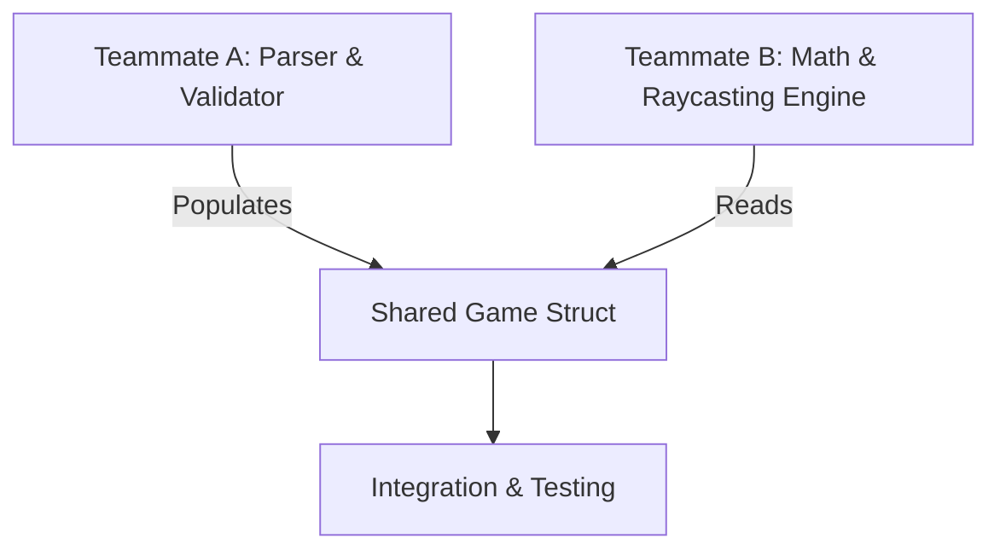

# cub3D: Work Separation and Workflow Strategy

This document outlines a recommended plan for splitting the work between two teammates and managing the implementation workflow for the cub3D project.

---

## 1. How to Separate the Work

The architecture of **cub3D** splits naturally into two independent components linked by a shared data structure. This allows both teammates to work in parallel with minimal git conflicts.

### Teammate A: The Parser & Data Validator
Focuses on reading, parsing, and validating the input file.
* **Responsibilities:**
  * Parse the `.cub` scene description file (textures `NO`, `SO`, `WE`, `EA`, and RGB colors `F`, `C`).
  * Parse the map grid into a 2D array.
  * Implement map validation (checking for invalid characters, and exactly one starting position: `N`, `S`, `E`, or `W`).
  * Implement a **flood-fill algorithm** to ensure the map is completely closed and surrounded by walls.
  * Implement memory cleanup functions to free all allocated memory and exit gracefully on error.

### Teammate B: The Raycasting Engine & Renderer
Focuses on the math, rendering, and player interaction.
* **Responsibilities:**
  * Initialize the **miniLibX** window and graphics buffers.
  * Implement the core **Raycasting algorithm** (using Digital Differential Analysis / DDA).
  * Calculate texture mapping (projecting vertical slices of wall textures onto the screen depending on the hit coordinate).
  * Handle user keyboard input (movement vector calculations for W, A, S, D, and rotation for arrow keys).
  * Implement frame rendering loops (with double buffering to prevent screen flickering).

### Key Point of Collaboration: The Shared Header
At the start of the project, both teammates must design and agree on the main game structure (e.g., `t_game` or `t_data`).
* Teammate A writes code to populate this structure from the `.cub` file.
* Teammate B reads from this structure to run the raycaster and game loop.

---

## 2. Workflow Strategy: Mandatory vs. Bonus

**Yes, you should finish the mandatory part first before touching the bonus features.**

According to the project subject:
> *Bonuses will be evaluated only if your mandatory part is perfect. [...] It means that if your mandatory part does not obtain ALL the points during the grading, your bonuses will be entirely IGNORED.*

### Recommended Workflow:
1. **Mandatory Focus:** Work together on a stable, bug-free, leak-free mandatory version.
2. **Commit & Freeze:** Once you have a fully working mandatory version, commit it and create a separate git branch (e.g., `git checkout -b bonus`).
3. **Decide on Bonuses:** Assess your remaining timeline. If you have time, add bonuses (such as wall collisions, doors, animated sprites, or minimap) on that branch.
4. **Defense Prep:** If the bonuses are unstable or buggy when evaluation approaches, you can discard them and turn in the clean, fully functional mandatory branch.
